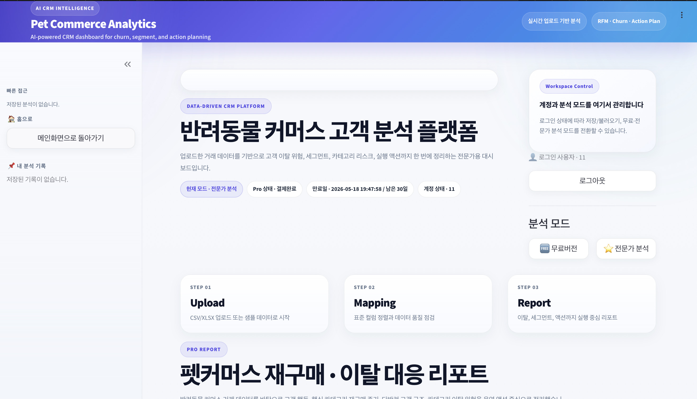
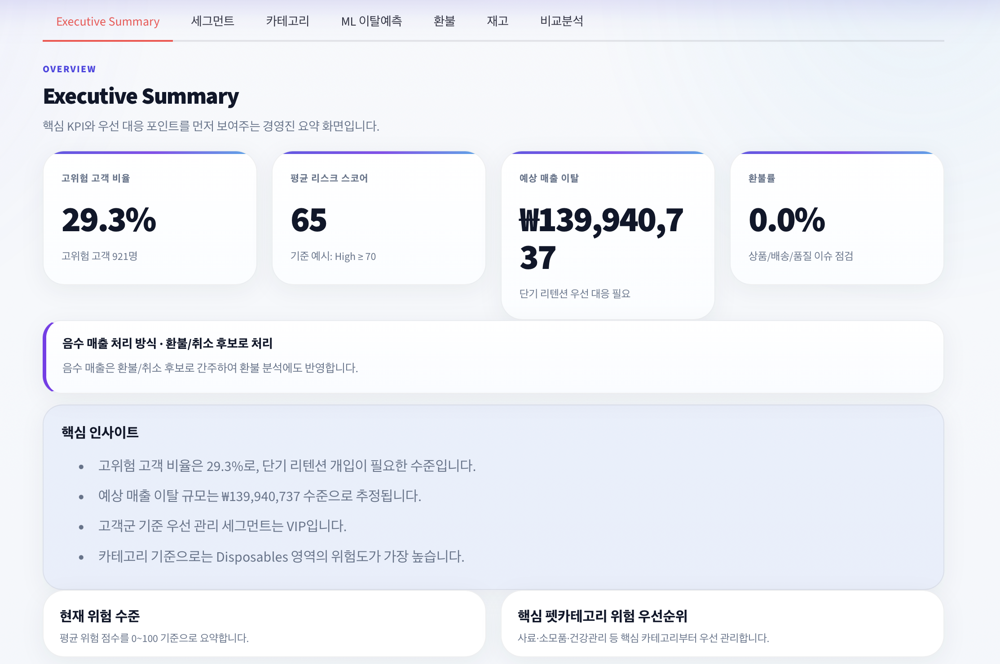
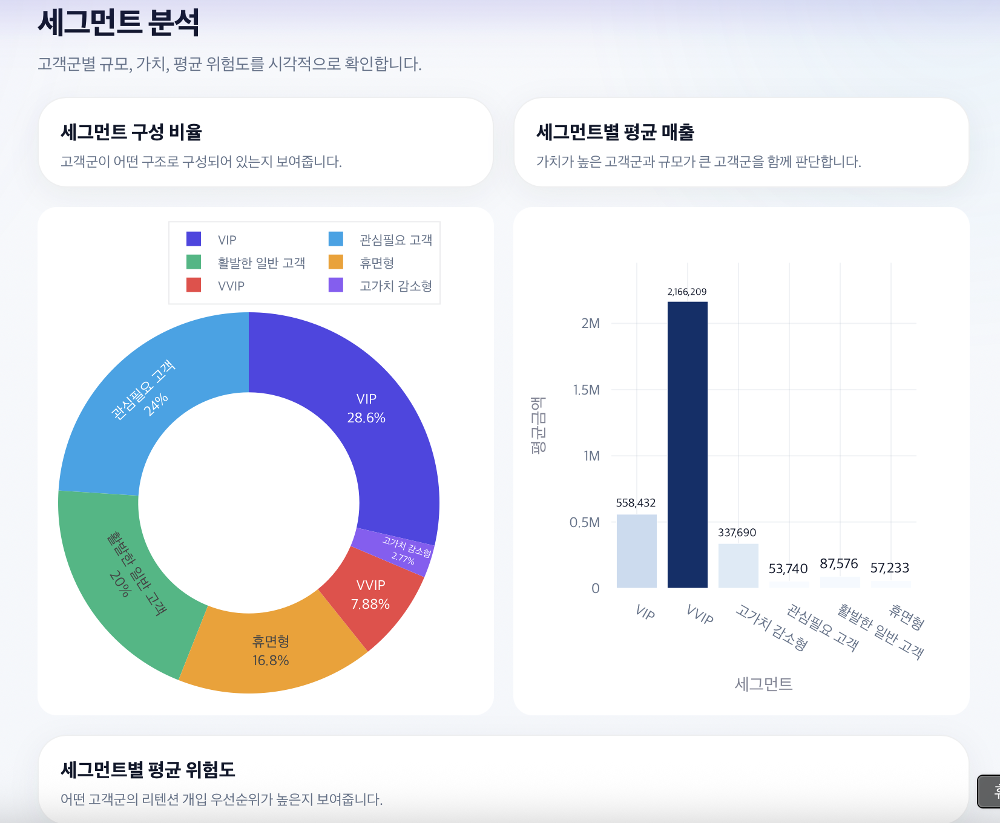
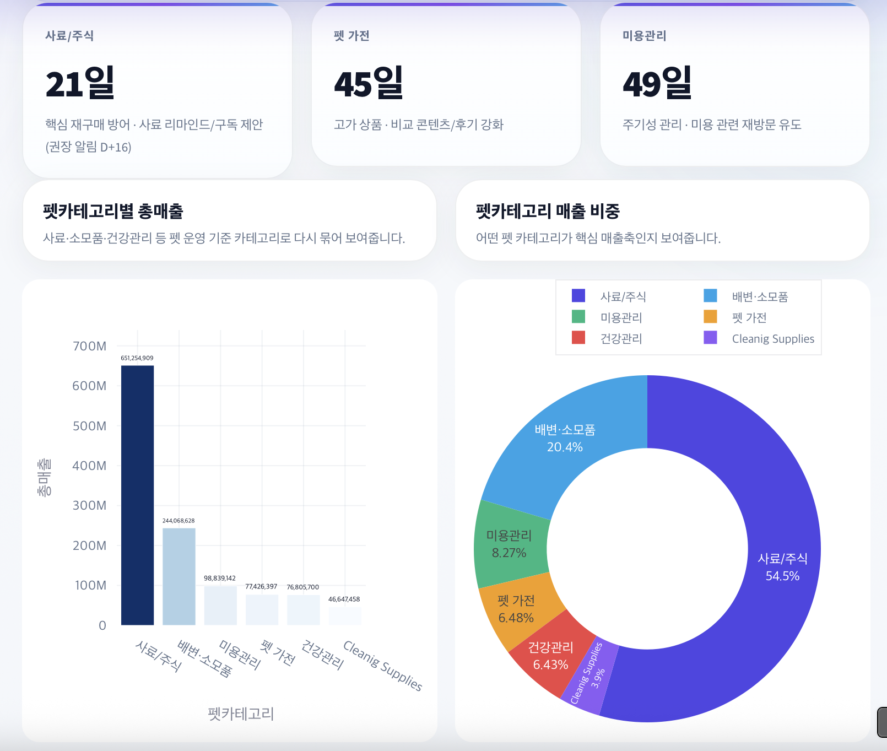
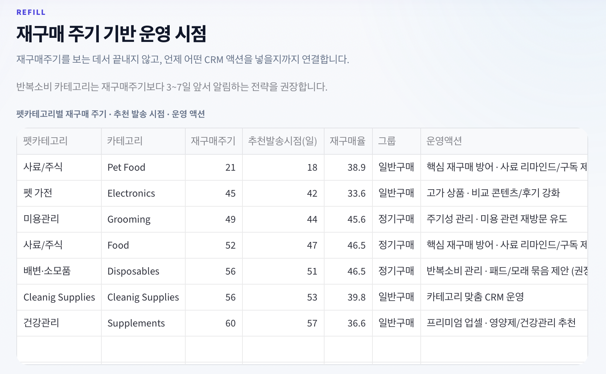
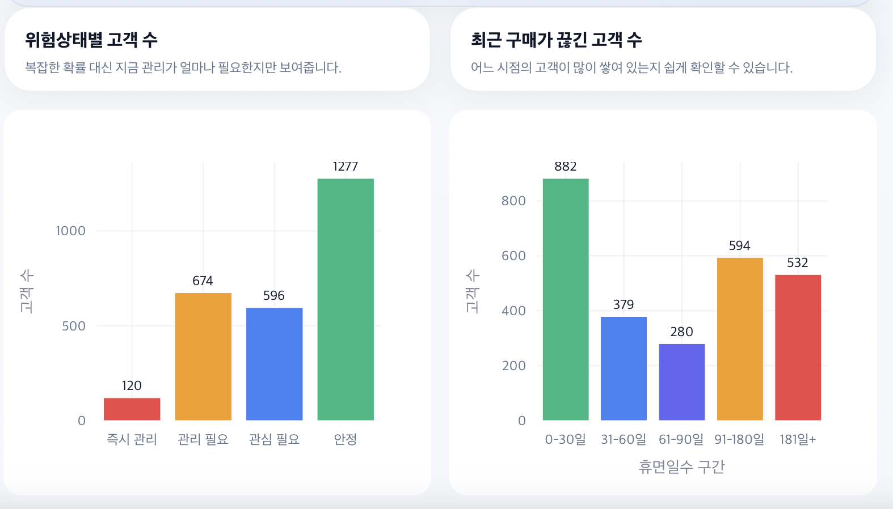
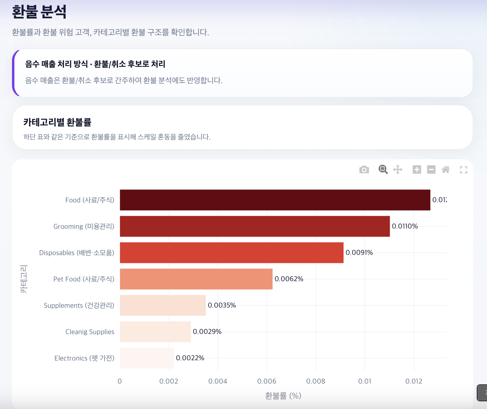
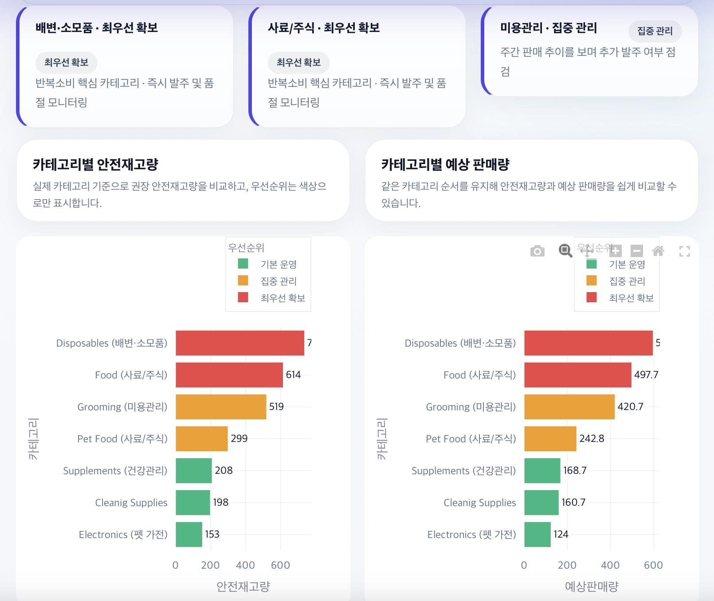

# 🐾 Pet Commerce CRM & Churn Prediction Platform

AI 기반 반려동물 커머스 고객 분석 및 이탈 예측 플랫폼입니다.  
실제 커머스 데이터를 기반으로 고객 세그먼트, 이탈 위험, 재구매 주기, 운영 액션까지 **한 번에 도출하는 CRM 분석 도구**를 개발했습니다.

---

## 🚀 Overview

이 프로젝트는 단순한 분석이 아닌  
👉 **"분석 → 인사이트 → 액션"까지 연결되는 실무형 플랫폼**을 목표로 합니다.

### 핵심 기능
- 고객 세그먼트 분석 (RFM 기반)
- 이탈 고객 예측 (Machine Learning)
- 카테고리별 이탈 분석
- 재구매 주기 기반 CRM 액션 추천
- 다반려 고객 추정
- PDF 리포트 자동 생성

---

## 🧠 Key Features

### 1. 데이터 통합 & 전처리
- 다양한 커머스 데이터 구조 자동 컬럼 매핑
- 데이터 품질 검증 및 정제
- 실무 데이터 대응 (결측, 컬럼 불일치 등)

### 2. 고객 분석
- RFM 기반 고객 세그먼트 분류
- VIP / 이탈 위험 / 휴면 고객 구분
- 세그먼트별 매출 및 행동 분석

### 3. 펫커머스 특화 분석
- 카테고리별 재구매 주기 분석
- 카테고리 단위 이탈 탐지
- 다반려 고객 추정 (구매 패턴 기반)

### 4. 머신러닝 이탈 예측
- LightGBM 기반 모델
- 3~6개월 / 6~12개월 이중 모델 구조
- Precision 기반 threshold 최적화
- ROC-AUC / PR-AUC / F1 등 다중 지표 평가

### 5. CRM 액션 추천
- 재구매 시점 기반 알림 추천
- 카테고리별 맞춤 마케팅 전략
- 고객 위험도 기반 우선순위 설정

### 6. 리포트 & 시각화
- KPI 대시보드
- Executive Summary 제공
- PDF 다운로드 지원

---

## 🖥️ Demo Screenshots

### Main Dashboard


### KPI Summary


### Segment Analysis


### Category Analysis


### Repurchase Cycle


### Churn Prediction


### Refund Analysis


### Inventory Analysis


---

## 🏗️ System Architecture

- **Frontend**: Streamlit (Custom UI)
- **Backend**: Python
- **ML Model**: LightGBM / Scikit-learn
- **Data Processing**: Pandas / NumPy
- **Visualization**: Plotly / Matplotlib
- **Database**: SQLite
- **Auth**: bcrypt / JWT

---

## ⚙️ Tech Stack

| Category | Tools |
|--------|------|
| Language | Python |
| Data | Pandas, NumPy |
| ML | Scikit-learn, LightGBM |
| Visualization | Plotly, Matplotlib |
| Web | Streamlit |
| DB | SQLite |
| Auth | bcrypt, JWT |

---

## 📊 Model Strategy

- 이탈 예측은 **불균형 데이터 문제**를 고려하여 설계
- 주요 평가 지표:
  - ROC-AUC (전체 구분력)
  - PR-AUC (소수 클래스 탐지력)
  - Precision (오탐 방지)
  - Recall (이탈 탐지율)
  - F1 Score (균형)

👉 실무 적용을 위해 **Precision 중심 threshold tuning 적용**

---

## 💡 Differentiation

기존 CRM 분석 도구와 차별점:

- 단순 분석 → ❌  
- **분석 + 액션 추천 → ✅**

- 전체 이탈 분석 → ❌  
- **카테고리 단위 이탈 분석 → ✅**

- 일반 커머스 → ❌  
- **펫커머스 도메인 특화 → ✅**

---

## 📌 Key Insight

- 고객 이탈은 단순히 "전체 이탈"이 아니라  
  👉 **카테고리 단위 이탈**에서 먼저 발생
- 재구매 주기는 CRM 타이밍의 핵심 지표
- 다반려 고객은 교차 판매의 핵심 타겟

---

## 🧩 Project Structure

```text
.
├── images/
├── models/
├── src/
├── static/
├── templates/
├── app.py
├── train_model.py
├── requirements.txt
└── README.md

▶️ How to Run
pip install -r requirements.txt
streamlit run app.py
📈 Future Work
다양한 커머스 플랫폼 데이터 확장
모델 성능 고도화 (AutoML, Ensemble)
SaaS 형태 서비스화
실시간 데이터 연동

👨‍💻 Author
김수민 (Data Analyst)
Multicampus 8th Project

⭐ Conclusion

이 프로젝트는 단순한 데이터 분석을 넘어
👉 실제 비즈니스 의사결정에 활용 가능한 CRM 플랫폼 구현을 목표로 합니다.